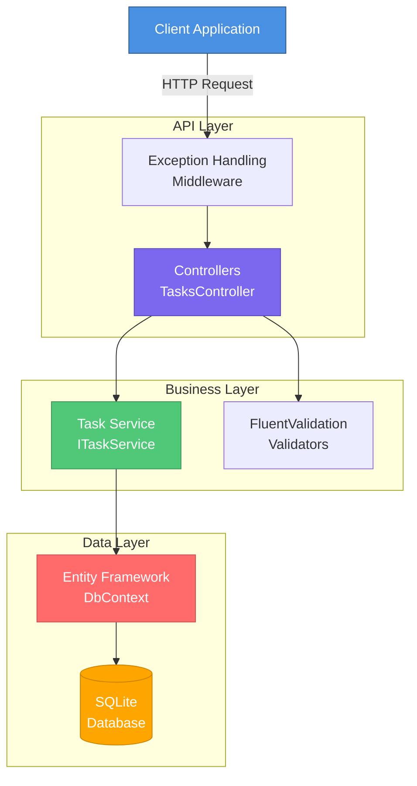
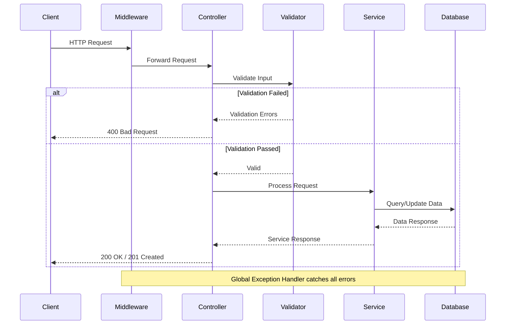

# 📋 Task Manager API

<div align="center">


**A robust RESTful API for task management built with ASP.NET Core, showcasing enterprise-grade architecture and best practices.**

[Features](#-features) • [Architecture](#-architecture) • [Getting Started](#-getting-started) • [API Documentation](#-api-documentation) • [Technologies](#-technologies)

</div>

---

## 🌟 Features

- ✅ **Complete CRUD Operations** - Create, Read, Update, and Delete tasks
- 🎯 **Priority Management** - Organize tasks by priority levels (Low, Medium, High, Urgent)
- 📊 **Task Statistics** - Real-time analytics and insights
- 🔍 **Advanced Filtering** - Filter tasks by completion status and priority
- ✔️ **Data Validation** - FluentValidation for robust input validation
- 📝 **Comprehensive Logging** - Serilog integration for detailed logging
- 🛡️ **Error Handling** - Global exception handling middleware
- 📚 **API Documentation** - Interactive Swagger/OpenAPI documentation
- 🏗️ **Clean Architecture** - Separation of concerns with layered design
- 💉 **Dependency Injection** - Built-in DI container for loose coupling

---

## 🏛️ Architecture

### Project Structure

```
TaskManagerApi/
├── 📁 src/
│   └── 📁 TaskManagerApi/
│       ├── 📁 Controllers/          # API endpoints
│       │   ├── TasksController.cs
│       │   └── HealthController.cs
│       ├── 📁 Services/             # Business logic layer
│       │   ├── ITaskService.cs
│       │   └── TaskService.cs
│       ├── 📁 Data/                 # Data access layer
│       │   └── TaskDbContext.cs
│       ├── 📁 Models/               # Domain entities
│       │   └── TaskItem.cs
│       ├── 📁 DTOs/                 # Data Transfer Objects
│       │   ├── TaskDtos.cs
│       │   └── TaskStatisticsDto.cs
│       ├── 📁 Validators/           # FluentValidation rules
│       │   └── TaskValidators.cs
│       ├── 📁 Middleware/           # Custom middleware
│       │   └── ExceptionHandlingMiddleware.cs
│       ├── Program.cs               # Application entry point
│       ├── appsettings.json
│       └── TaskManagerApi.csproj
├── 📁 tests/                 # Test scripts
│   ├── test-crud.ps1         # PowerShell test script
│   └── test-crud.sh          # Bash test script
├── .gitignore
├── TaskManagerApi.sln
└── README.md
```

### 🎨 Architecture Diagram



### 🔄 Request Flow



---

## 🚀 Getting Started

### Prerequisites

- [.NET 8.0 SDK](https://dotnet.microsoft.com/download/dotnet/8.0) or later
- [Visual Studio 2022](https://visualstudio.microsoft.com/) or [VS Code](https://code.visualstudio.com/)
- [Git](https://git-scm.com/)

### Installation

1. **Clone the repository**
   ```bash
   git clone https://github.com/AnderssonProgramming/dotnet-task-manager-api.git
   cd dotnet-task-manager-api
   ```

2. **Restore dependencies**
   ```bash
   dotnet restore
   ```

3. **Build the project**
   ```bash
   dotnet build
   ```

4. **Run the application**
   ```bash
   cd src/TaskManagerApi
   dotnet run
   ```

5. **Access the API**
   - Swagger UI: `http://localhost:5000` or `https://localhost:5001`
   - API Base URL: `http://localhost:5000/api`

---

## 📖 API Documentation

### Endpoints Overview

| Method | Endpoint | Description |
|--------|----------|-------------|
| `GET` | `/api/tasks` | Get all tasks (with optional filters) |
| `GET` | `/api/tasks/{id}` | Get a specific task by ID |
| `POST` | `/api/tasks` | Create a new task |
| `PUT` | `/api/tasks/{id}` | Update an existing task |
| `DELETE` | `/api/tasks/{id}` | Delete a task |
| `PATCH` | `/api/tasks/{id}/complete` | Mark a task as completed |
| `GET` | `/api/tasks/statistics` | Get task statistics |
| `GET` | `/api/health` | Health check endpoint |

### 📝 Example Requests

#### Create a Task

```http
POST /api/tasks
Content-Type: application/json

{
  "title": "Complete project documentation",
  "description": "Write comprehensive README with examples",
  "priority": 2,
  "dueDate": "2026-01-15T00:00:00Z"
}
```

**Response (201 Created)**
```json
{
  "id": 4,
  "title": "Complete project documentation",
  "description": "Write comprehensive README with examples",
  "isCompleted": false,
  "priority": 2,
  "dueDate": "2026-01-15T00:00:00Z",
  "createdAt": "2026-01-04T10:30:00Z",
  "updatedAt": "2026-01-04T10:30:00Z"
}
```

#### Get All Tasks

```http
GET /api/tasks?isCompleted=false&priority=2
```

**Response (200 OK)**
```json
[
  {
    "id": 3,
    "title": "Implement CRUD Operations",
    "description": "Create endpoints for Create, Read, Update, and Delete operations",
    "isCompleted": false,
    "priority": 1,
    "dueDate": "2026-01-11T00:00:00Z",
    "createdAt": "2026-01-04T00:00:00Z",
    "updatedAt": "2026-01-04T00:00:00Z"
  }
]
```

#### Update a Task

```http
PUT /api/tasks/3
Content-Type: application/json

{
  "isCompleted": true
}
```

#### Get Statistics

```http
GET /api/tasks/statistics
```

**Response (200 OK)**
```json
{
  "totalTasks": 10,
  "completedTasks": 6,
  "pendingTasks": 4,
  "overdueTasks": 1,
  "tasksByPriority": {
    "Low": 2,
    "Medium": 4,
    "High": 3,
    "Urgent": 1
  }
}
```

---

## 🛠️ Technologies

### Core Framework
- **ASP.NET Core 8.0** - Web framework
- **C# 12** - Programming language
- **.NET 8.0** - Runtime platform

### Data & Persistence
- **Entity Framework Core 8.0** - ORM
- **SQLite** - Embedded database

### Validation & Documentation
- **FluentValidation 11.3** - Input validation
- **Swashbuckle/Swagger 6.5** - API documentation

### Logging & Monitoring
- **Serilog 8.0** - Structured logging
- **Serilog.AspNetCore** - ASP.NET Core integration

---

## 🧪 Testing the API

### Using Swagger UI

1. Navigate to `http://localhost:5000`
2. Explore all available endpoints
3. Try out requests directly from the browser

### Using cURL

```bash
# Create a task
curl -X POST "http://localhost:5000/api/tasks" \
  -H "Content-Type: application/json" \
  -d '{
    "title": "Test Task",
    "description": "Testing the API",
    "priority": 1
  }'

# Get all tasks
curl -X GET "http://localhost:5000/api/tasks"

# Get specific task
curl -X GET "http://localhost:5000/api/tasks/1"

# Update task
curl -X PUT "http://localhost:5000/api/tasks/1" \
  -H "Content-Type: application/json" \
  -d '{
    "title": "Updated Task",
    "isCompleted": true
  }'

# Delete task
curl -X DELETE "http://localhost:5000/api/tasks/1"
```

---

## 📊 Key Concepts Demonstrated

### 1️⃣ **Dependency Injection**
```csharp
// Service Registration
builder.Services.AddScoped<ITaskService, TaskService>();

// Constructor Injection
public class TasksController : ControllerBase
{
    private readonly ITaskService _taskService;
    
    public TasksController(ITaskService taskService)
    {
        _taskService = taskService;
    }
}
```

### 2️⃣ **Repository Pattern with EF Core**
```csharp
public class TaskService : ITaskService
{
    private readonly TaskDbContext _context;
    
    public async Task<TaskDto> CreateTaskAsync(CreateTaskDto dto)
    {
        var task = new TaskItem { /* mapping */ };
        _context.Tasks.Add(task);
        await _context.SaveChangesAsync();
        return MapToDto(task);
    }
}
```

### 3️⃣ **Data Transfer Objects (DTOs)**
- Separation between domain models and API contracts
- Input validation at the API boundary
- Response shaping for clients

### 4️⃣ **FluentValidation**
```csharp
public class CreateTaskDtoValidator : AbstractValidator<CreateTaskDto>
{
    public CreateTaskDtoValidator()
    {
        RuleFor(x => x.Title)
            .NotEmpty()
            .MaximumLength(200);
    }
}
```

### 5️⃣ **Global Exception Handling**
```csharp
public class ExceptionHandlingMiddleware
{
    public async Task InvokeAsync(HttpContext context)
    {
        try
        {
            await _next(context);
        }
        catch (Exception ex)
        {
            await HandleExceptionAsync(context, ex);
        }
    }
}
```

---

## 🎯 Learning Outcomes

By exploring this project, you'll understand:

- ✅ **ASP.NET Core Structure** - Modern web API architecture
- ✅ **RESTful API Design** - Best practices and conventions
- ✅ **Entity Framework Core** - Code-first database approach
- ✅ **Dependency Injection** - Inversion of Control principles
- ✅ **Clean Architecture** - Layered separation of concerns
- ✅ **Input Validation** - Using FluentValidation
- ✅ **Logging** - Structured logging with Serilog
- ✅ **Error Handling** - Global exception middleware
- ✅ **API Documentation** - Swagger/OpenAPI integration
- ✅ **LINQ** - Querying data efficiently

---

## 🔮 Future Enhancements

- [ ] **Authentication & Authorization** - JWT tokens, role-based access
- [ ] **Unit & Integration Tests** - xUnit, Moq, TestServer
- [ ] **Pagination** - Efficient data retrieval for large datasets
- [ ] **Caching** - Redis integration for performance
- [ ] **Docker Support** - Containerization
- [ ] **CI/CD Pipeline** - GitHub Actions
- [ ] **Database Migrations** - EF Core migrations
- [ ] **Rate Limiting** - API throttling
- [ ] **API Versioning** - Support multiple API versions

---

## 📝 Configuration

### Database Connection

The application uses SQLite by default. Update `appsettings.json` to change the database:

```json
{
  "ConnectionStrings": {
    "DefaultConnection": "Data Source=taskmanager.db"
  }
}
```

### Logging Configuration

Logs are written to:
- **Console** - Real-time output
- **File** - `logs/taskmanager-{Date}.txt`

Configure in `appsettings.json`:
```json
{
  "Serilog": {
    "MinimumLevel": {
      "Default": "Information"
    }
  }
}
```

---

## 🤝 Contributing

Contributions are welcome! Please feel free to submit a Pull Request.

1. Fork the project
2. Create your feature branch (`git checkout -b feature/AmazingFeature`)
3. Commit your changes (`git commit -m 'feat: add some amazing feature'`)
4. Push to the branch (`git push origin feature/AmazingFeature`)
5. Open a Pull Request

---

## 📄 License

This project is licensed under the MIT License - see the [LICENSE](LICENSE) file for details.

---

## 👨‍💻 Author

**Andersson Programming**

- GitHub: [@AnderssonProgramming](https://github.com/AnderssonProgramming)
- Project Link: [https://github.com/AnderssonProgramming/dotnet-task-manager-api](https://github.com/AnderssonProgramming/dotnet-task-manager-api)

---

## 🙏 Acknowledgments

- [ASP.NET Core Documentation](https://docs.microsoft.com/aspnet/core)
- [Entity Framework Core](https://docs.microsoft.com/ef/core)
- [FluentValidation](https://fluentvalidation.net/)
- [Serilog](https://serilog.net/)

---

<div align="center">

**⭐ If you find this project helpful, please consider giving it a star! ⭐**

Made with ❤️ for learning and sharing knowledge

</div>